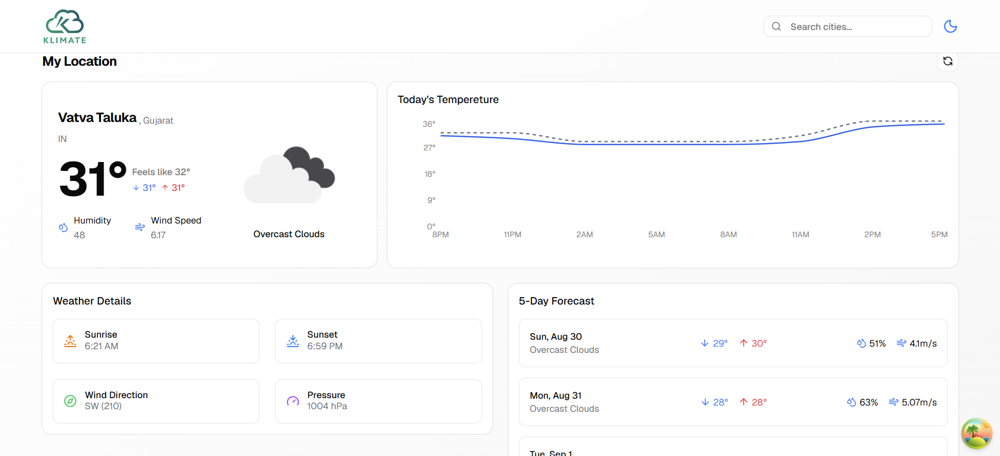

# Weather App

A weather dashboard built with React, TypeScript, and Vite. Search any city, save favorites, and view current conditions, hourly trends, and a 5-day forecast — all powered by the OpenWeatherMap API.



## Features

- **Current weather** for your detected location or any searched city — temperature, "feels like", humidity, wind speed, and conditions
- **City search** with search history
- **Favorite cities** for quick access
- **Hourly temperature chart** for the day
- **5-day forecast** with highs, lows, humidity, and wind
- **Extra weather details** — sunrise/sunset, wind direction, pressure
- **Light/dark theme** toggle
- **Geolocation** support to auto-load local weather

## Tech Stack

- [React 19](https://react.dev/) + [TypeScript](https://www.typescriptlang.org/)
- [Vite](https://vitejs.dev/) for tooling and dev server
- [TanStack Query](https://tanstack.com/query) for data fetching and caching
- [React Router](https://reactrouter.com/) for routing
- [Tailwind CSS](https://tailwindcss.com/) + [shadcn/ui](https://ui.shadcn.com/) for styling and components
- [Recharts](https://recharts.org/) for the temperature chart
- [OpenWeatherMap API](https://openweathermap.org/api) for weather data

## Getting Started

### Prerequisites

- Node.js (v18+ recommended)
- An [OpenWeatherMap API key](https://home.openweathermap.org/api_keys) (free tier works)

### Installation

```bash
npm install
```

### Environment Variables

Create a `.env` file in the project root:

```
VITE_OPENWEATHER_API_KEY=your_api_key_here
```


### Run the dev server

```bash
npm run dev
```


## Project Structure

```
src/
├── api/            # OpenWeatherMap API config, types, and requests
├── components/     # UI components (search, forecast, header, etc.)
│   └── ui/         # shadcn/ui primitives
├── context/        # Theme provider
├── hooks/          # Custom hooks (weather data, favorites, geolocation, etc.)
├── pages/          # Route pages (dashboard, city page)
├── App.tsx         # App routes and providers
└── main.tsx        # Entry point
```

